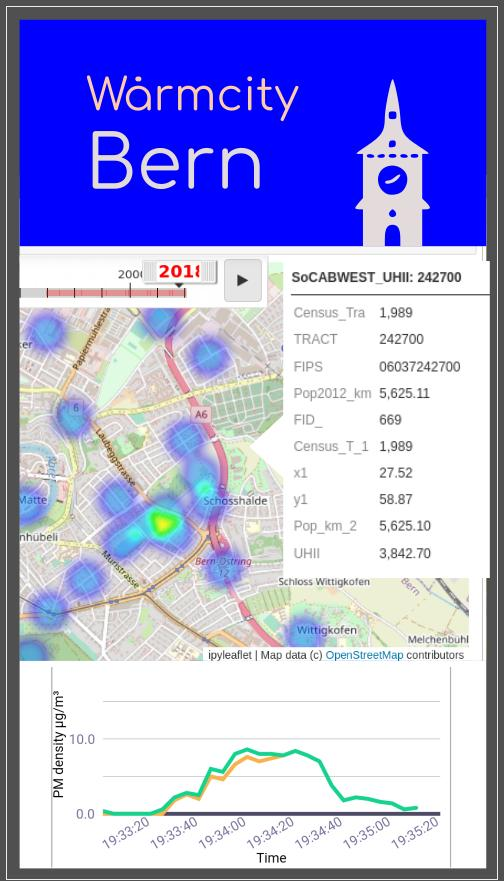

Project notes
===

Additional notes on this topic. Thank you to Maud, Andrea and all contributors to the 2021 Energy & Climate Hack where we started this!

This is a mockup of an app that we have imagined building with this data. The source, made with Inkscape, is in the `sketch` folder. You can see:

- an OpenStreetMap heatmap visualizing the data, with a tooltip (borrowed from the [UHI explorer](https://yceo.users.earthengine.app/view/uhimap)) containing further indicators on any given point;
- a time slider (borrowed from "[A journey through time](https://www.swisstopo.admin.ch/en/maps-data-online/maps-geodata-online/journey-through-time.html)" by swisstopo) allows progressing through days or weeks of data;
- a graph (borrowed from the [logair.io](https://logair.io) app), which reads out a statistical summary of the data with daily, weekly or seasonal variations.

## Datasets

- Urban heat data from EU Copernicus https://climate.copernicus.eu/urban-heat
- Data about heat spots in Paris  https://www.apur.org/dataviz/plu-diagnostic-territorial/
- OpenStreetMap (OSM) is a treasure trove of open geospatial data with streets, buildings and >1001 POIs. Here's a compilation of resources: https://etherpad.wikimedia.org/p/OSM
- Datasets related to climate change maintained by Open Knowledge: https://github.com/datasets/awesome-data/blob/master/climate-change.md + https://datahub.io/collections/climate-change
- Open Data from LoRa-enabled sensors of the Kanton of Zürich: https://www.zh.ch/de/politik-staat/opendata.html?keyword=ogd#/details/563@awel-kanton-zuerich - See also: https://www.zh.ch/de/umwelt-tiere/klima/klimakarte-daten.html#63279247

## Applications

- Global Surface UHI Explorer https://yceo.users.earthengine.app/view/uhimap
- lifeASTI - Urban Heat Island Forecasting System https://app.lifeasti.eu/ + https://play.google.com/store/apps/details?id=eu.getmap.lifeasti
- Cozie - crowdsourced temperature effects http://datadrivenlab.org/big-data-2/cozie/
- Open hardware/source project for pollution (and temperature! etc.) monitoring in the city https://logair.io
- An online tool which promises to make a quick and easy heatmap: http://www.heatmapper.ca/
- Bern's favorite temperature-reading app, for inspiration: https://aare.guru/#bern
- @statistik_zh has developed a webApp for ‘Amt für Abfall, Wasser, Energie & Luft’ at the Kanton of Zuerich for local climate monitoring: https://openzh.shinyapps.io/Lokalklima/ See also: https://www.zh.ch/de/umwelt-tiere/klima/klimakarte-daten.html#63279247

## Code

- A Python module for cartography: http://scitools.github.io/cartopy/ - here is a tutorial for the basic setup: https://makersportal.com/blog/2020/4/24/geographic-visualizations-in-python-with-cartopy
- For doing animated time series: https://carto.com/help/tutorials/understanding-the-time-series-widget/ or Leaflet http://urban.cs.wpi.edu/CityView/datasets/timeSeriesData_leaflet.html
- A tutorial, skim on details, but basically what we're aiming at: https://medium.com/@lyric09220/how-to-create-a-cool-seismic-heat-map-with-20-lines-of-python-code-e9b4bd9bc0b2
- Anaconda is a popular way to install a data science environment on your computer https://www.anaconda.com/products/individual

## Literature

- Background (in German) in local media on the Urban Climate Bern project https://www.geography.unibe.ch/unibe/portal/fak_naturwis/e_geowiss/c_igeogr/content/e39603/e68757/e84588/e728217/e1098766/BU20-6-2021KlimaforscherMoritz_eng.pdf
- Sample data from the research project published open access here: https://www.sciencedirect.com/science/article/pii/S2212095521001152?via%3Dihub#s0160
- A policy-making challenge from the City of Zürich which mentions open data https://www.policykitchen.com/group/how-engage-zurichs-citizens-creation-circular-and-renewable-energy-districts/about

Further contributions via Pull Request or email to oleg at opendata.ch are welcome!
